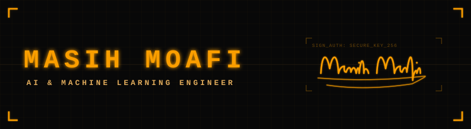

<div align="center">

<!-- Deus Ex themed Banner -->


<p align="center">
  <a href="https://masihmoafi.com" target="_blank">
    
  </a>
  &nbsp;&nbsp;&nbsp;&nbsp;
  <a href="https://linkedin.com/in/masihmoafi1" target="_blank">
    
  </a>
</p>

[](https://twitter.com/MasihMoafi1)
[](https://github.com/MasihMoafi)
[](mailto:masihmoafi12@gmail.com)
[](mailto:m.moafi@el.iut.ac.ir)

</div>

---

## 🎯 About Me

I'm passionate about making AI accessible and practical. I build tools that leverage cutting-edge AI/ML technologies. My focus areas include NLP, computer vision, and developing modular AI systems.

## 🚀 Featured Projects

### 🏆 Most Popular
- **[A-Modular-Kingdom](https://github.com/MasihMoafi/A-Modular-Kingdom)** - Comprehensive MCP Host (28⭐)
- **[Voice Commander](https://github.com/MasihMoafi/Voice-commander)** - Vocal Prompt Engineer (15⭐)
- **[Eyes-Wide-Shut](https://github.com/MasihMoafi/Eyes-Wide-Shut)** - Red-teaming gpt-oss:20b (15⭐)
- **[Financial Market Analysis](https://github.com/MasihMoafi/Financial-Market-Analysis)** - Time-series forecasting with Transformers (10⭐)

## 💻 Tech Stack

```python
tech_stack = {
    "languages": ["Python"],
    "ml_frameworks": ["PyTorch"],
    "dl_specializations": ["Transformers"],
    "computer_vision": ["Vision Transformers"],
    "tools": ["Git", "Docker", ...],
    "interests": [RUST, Post-training"]
}
```

## 🌱 Currently Working On

- 🥷 Studying for my masters at IUT
- 🤖 Developing modular AI agent system infrastructures 
- 🔊 Exploring voice-controlled AI interfaces
- 📚 Contributing to open-source AI/ML projects

## 📫 Let's Connect

<div align="center">

[](https://twitter.com/MasihMoafi1)
[](mailto:masihmoafi12@gmail.com)
[](mailto:m.moafi@el.iut.ac.ir)
[](https://github.com/MasihMoafi)
[](https://linkedin.com/in/masihmoafi1)

</div>

---

<div align="center">


### 💡 "Building the future, one algorithm at a time"

⭐️ **Found something useful? Give it a star!**

</div>
